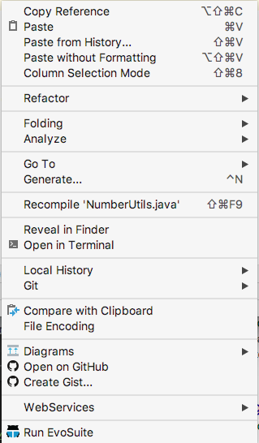
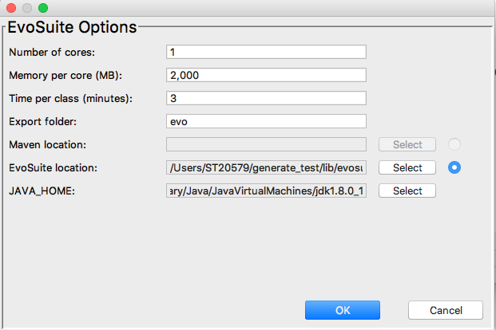

# How to generate unit test with EvoSuite.

## Summary

- [EvoSuite](http://www.evosuite.org/)
- IntelliJ plugin and java library.
- Auto generate unit tests in Java with JUnit 4.
- Optimizes whole test suites towards satisfying a coverage criterion.

## Preparation
1. Install IntelliJ plugin of EvoSuite plugin.
2. Download executable jar of evosuite or use {this repo directory}/lib/evosuite-1.0.6.jar to generate unit tests.
3. Download runtime jar of evosuite or use {this repo directory}/build.gradle to run unit tests.

## How to generate unit test.

1. Open original code on  IntelliJ.
2. Select pop up menus: Run Evosuite.
 
3. Set options on pop up menu according to the following
- Select executable jar of evosuite for "EvoSuite location".
- Select your JDK path for "JAVA_HOME".
- Select output directory for generated test codes for "Export folder".
 
4. Press OK button on pop up menu.
5. Will generate unit tests on output directory.
