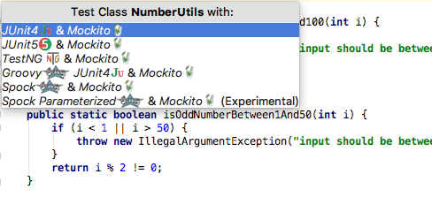

# How to generate unit test with TestMe.

## Summary 

- [TestMe](https://plugins.jetbrains.com/plugin/9471-testme/)
- IntelliJ plugin.
- Auto generate unit tests in Java with JUnit 4/5 etc. 

## Preparation
1. Install IntelliJ plugin of TestMe.

## How to generate unit test.

1. Open original code on  IntelliJ.
2. Select menus: Code -> TestMe.
3. Select test framework from JUnit 4/5 etc.

 

4. Will generate unit tests on your test directory.
